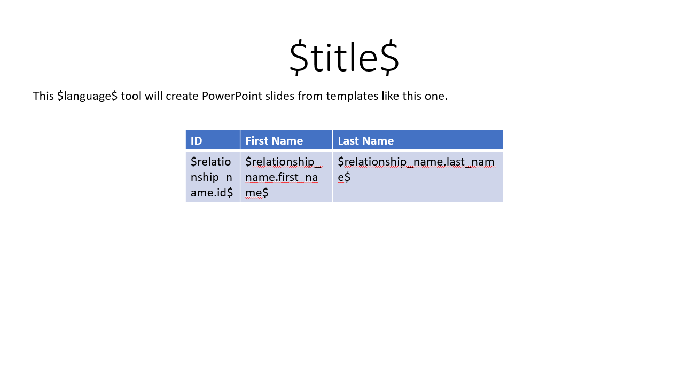
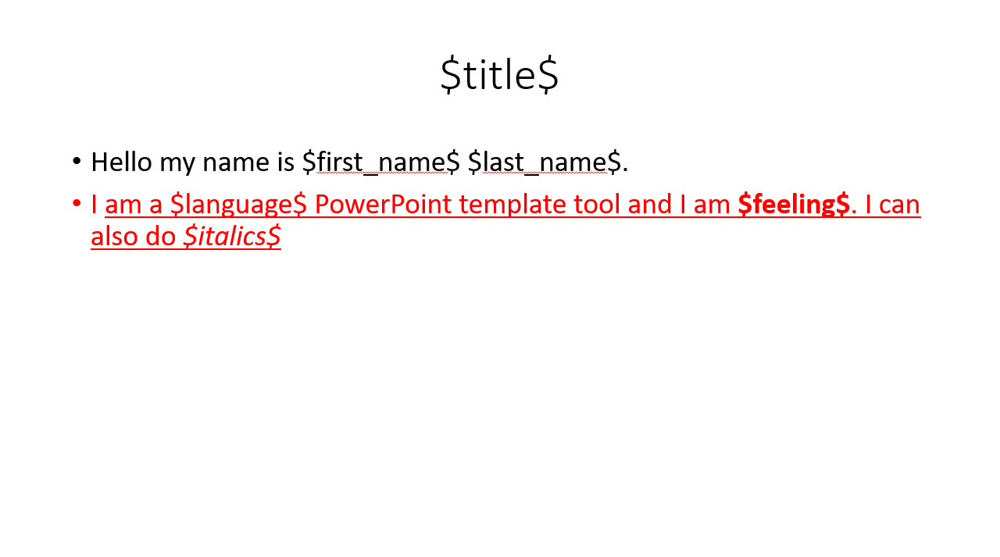
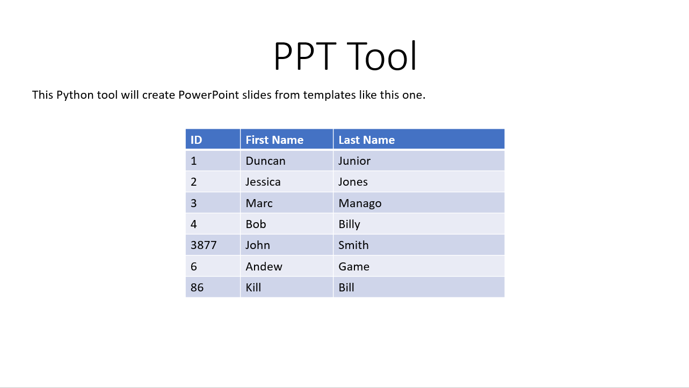
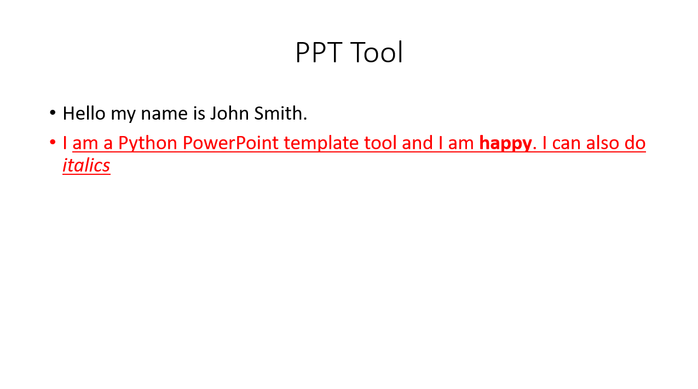

[](https://pepy.tech/project/templatepptx)

# Description

Use PowerPoint templates to generate PowerPoint files based on PowerPoint templates. The PowerPoints are generated on the fly using "magic words". Magic words are specified by using the `$` sign symbol. You can specify magic words in PowerPoint templates by wrapping the word like `$this$`. This tool is simple to run and setup. 

## How to Install 
`pip install templatepptx`

The data is populated by using a "context" object. A context object is a dictionary which contains the keywords and thier values that are used to populate the powerpoint. Additionally, tables can be populated with an unlmited number of related data by specifying a list of dictionaries in your context. A related table variable is specified in the template by adding the prefix "relationship_" to the front of the key. Please observe the following example of a context object below.

## How to Use

To run this tool you will need a template PowerPoint that contains slides that have magic keywords. You will need a context file with the key words and you will need a valid PPTX file path for the output.

```
import templatepptx

input_pptx = "path//to//input.pptx"
output_pptx = "path//to//output.pptx"
context = {
    "first_name" : "John",
    "last_name" : "Smith",
    "language" : "Python",
    "title" : "PPT Tool",
    "italics" : "italics",
    "feeling" : "happy",
    "relationship_name" : [ # This key contains the list which can contain an unlimited amount of records to populate a table.
    {
        "id" : "1",
        "first_name" : "Duncan",
        "last_name" : "Junior"},
    {
        "id" : "2",
        "first_name" : "Jessica",
        "last_name" : "Jones"}]
    }

templatepptx.parse_template_pptx(input_pptx, context, output_pptx)
```

## Other Features

You can generate many similar output products from a small group of templates and then combining these outputs into one final product. There is an automated function built into this module which permits you to point to a whole direct, scrape all of the .pptx files and then combine them into one .pptx file. Please note you will need a Windows machine with PowerPoint installed to use this functionality. In the future, the Windows requirment will be removed.

```
import templatepptx
in_dir = "path//to//input_dir"
out_combined = "path//to//combined_output.pptx"
templatepptx.combine_slides(in_dir, out_combined):
```


## Future Planned Features
- ArcGIS Feature Service Support
- MSSQL support


## Example

Example input slides.



Example output slides.


